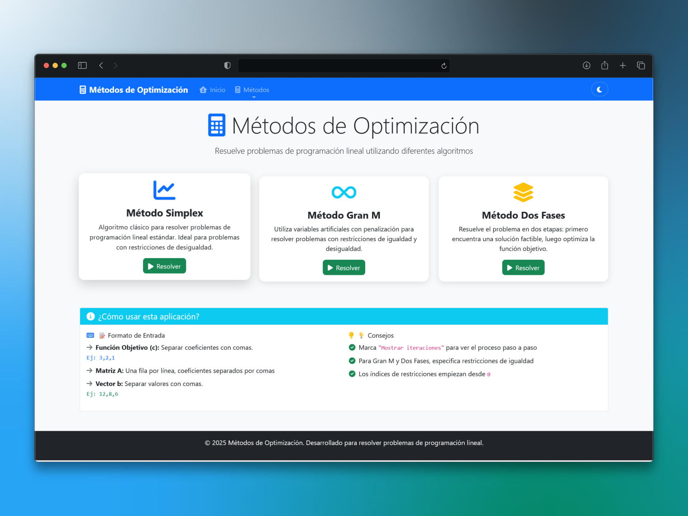

# Matemáticas Avanzadas - Métodos de Optimización

Aplicación Flask para resolver problemas de programación lineal usando distintos métodos de optimización y visualizar los resultados mediante animaciones generadas con Manim.

## Interfaz de la Aplicación



*Interfaz principal de la aplicación mostrando los tres métodos de optimización disponibles: Simplex, Gran M y Dos Fases.*

## Características

- Implementación de diferentes métodos de optimización:
  - Método Simplex
  - Método de la Gran M
  - Método de las Dos Fases
- Interfaz web con templates HTML para interacción
- API REST para resolver problemas
- Generación de animaciones visuales de los problemas y sus soluciones usando Manim
- Carga y descarga de ejemplos en formato JSON
- Interfaz web estática para visualización

## Estructura del Proyecto

```
matematicas-avanzadas/
│
├── app/
│   ├── __init__.py
│   ├── routes.py                   # Endpoints web y API
│   ├── manim_renderer.py           # Renderizado de animaciones Manim
│   ├── solvers/                    # Implementaciones de algoritmos
│   │   ├── __init__.py
│   │   ├── simplex_solver.py       # Método Simplex
│   │   ├── granm_solver.py         # Método Gran M
│   │   └── dosfases_solver.py      # Método de Dos Fases
│   ├── static/                     # Archivos CSS, JS, imágenes
│   └── templates/                  # Plantillas HTML
│
├── manim_anim/                     # Scripts de animación Manim
│   ├── basic_simplex_anim.py
│   ├── advanced_simplex_anim.py
│   ├── granm_dosfases_anim.py
│   ├── simplex_2d_anim.py
│   ├── simplex_3d_anim.py
│   ├── casos.json                  # Casos de prueba
│   ├── problem_data.json           # Datos del problema actual
│   ├── casos_simplex/              # Casos específicos
│   └── media/                      # Videos generados
│
├── metodos-opt/                    # Directorio de trabajo alternativo
├── metodos-optimizacion/           # Entorno virtual Python
├── output/                         # Directorio de salida
│   └── videos/                     # Videos exportados
├── uploads/                        # Archivos subidos por usuarios
│
├── run.py                          # Punto de entrada de la aplicación
├── requirements.txt                # Dependencias Python
├── test_integration.py             # Pruebas de integración
├── test_manim.py                   # Pruebas de Manim
└── README.md
```

## Instalación

1. Clona el repositorio:
```bash
git clone <url-del-repositorio>
cd matematicas-avanzadas
```

2. Crea y activa un entorno virtual:
```powershell
# Para Windows (PowerShell)
python -m venv metodos-optimizacion
metodos-optimizacion\Scripts\Activate.ps1

# Para Windows (Command Prompt)
python -m venv metodos-optimizacion
metodos-optimizacion\Scripts\activate.bat

# Para Linux/Mac
python3 -m venv metodos-optimizacion
source metodos-optimizacion/bin/activate
```

3. Instala las dependencias:
```bash
pip install -r requirements.txt
```

4. Para generar animaciones, asegúrate de tener las dependencias de Manim:
   - **FFmpeg** - Requerido para renderizado de video
   - **LaTeX** - Opcional, para fórmulas matemáticas avanzadas
   - **Cairo y Pango** - Para renderizado gráfico

   En Windows puedes instalar FFmpeg desde [https://ffmpeg.org/download.html](https://ffmpeg.org/download.html)

## Ejecución

Para ejecutar la aplicación:

```bash
python run.py
```

La aplicación estará disponible en `http://localhost:5000`

## API Endpoints

### Gestión de Casos
- `GET /api/casos` - Obtener todos los ejemplos guardados
- `GET /api/casos/{id}` - Obtener un ejemplo específico
- `POST /api/casos` - Agregar un nuevo ejemplo
- `DELETE /api/casos/{id}` - Eliminar un ejemplo

### Resolución de Problemas
- `POST /api/resolver/simplex` - Resolver usando el método Simplex
- `POST /api/resolver/granm` - Resolver usando el método Gran M
- `POST /api/resolver/dosfases` - Resolver usando el método de Dos Fases

### Animaciones y Visualización
- `POST /api/animar` - Generar una animación para un problema
- `GET /api/videos/{filename}` - Descargar video generado
- `GET /api/static/{filename}` - Servir archivos estáticos

### Interfaz Web
- `GET /` - Página principal con interfaz web
- `GET /casos` - Vista de gestión de casos
- `GET /resolver` - Interfaz para resolver problemas

## Formato de Entrada

Para resolver un problema, envía un JSON con la siguiente estructura:

```json
{
  "c": [5, 7],               // Coeficientes de la función objetivo
  "A": [[2, 3], [1, 1], [1, 0]], // Matriz de restricciones
  "b": [12, 5, 3],           // Valores de lado derecho de restricciones
  "minimize": false,         // true para minimizar, false para maximizar
  "eq_constraints": [0],     // Índices de restricciones de igualdad (opcional)
  "track_iterations": true   // Devolver historial de iteraciones (opcional)
}
```

## Ejemplos y Pruebas

### Archivos de Ejemplo
- `manim_anim/casos.json` - Casos de prueba predefinidos
- `manim_anim/problem_data.json` - Formato de datos para problemas
- `test_problem_data.json` - Datos de prueba en el directorio raíz

### Ejecutar Pruebas
```bash
# Pruebas de integración
python test_integration.py

# Pruebas de Manim
python test_manim.py
```

### Archivos de Salida
- Videos generados se guardan en `output/videos/` y `manim_anim/media/`
- Archivos subidos por usuarios se almacenan en `uploads/`

## Desarrollo

El proyecto está configurado para desarrollo con:
- **Flask** como framework web
- **Manim** para generación de animaciones
- **NumPy** para cálculos matemáticos
- **Jinja2** para templates HTML

### Entorno Virtual
El entorno virtual está configurado en `metodos-optimizacion/` y está excluido del control de versiones mediante `.gitignore`.

## Licencia

Este proyecto está bajo la Licencia MIT.
